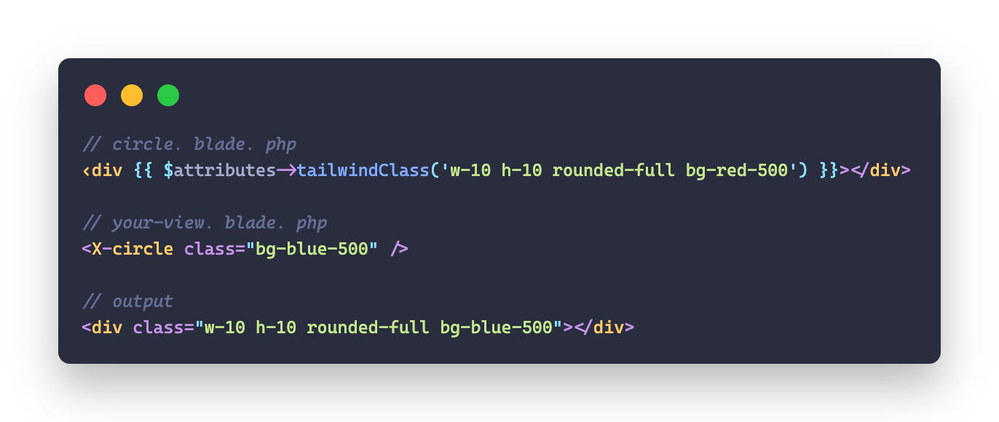

<p align="center">
    
    <p align="center">
        <a href="https://github.com/devanoxLtd/tailwind-class-merge-laravel/actions"></a>
        <a href="https://packagist.org/packages/devanox/tailwind-class-merge-laravel"></a>
        <a href="https://packagist.org/packages/devanox/tailwind-class-merge-laravel"></a>
        <a href="https://packagist.org/packages/devanox/tailwind-class-merge-laravel"></a>
    </p>
</p>

------

**TailwindClassMerge for Laravel** allows you to merge multiple [Tailwind CSS](https://tailwindcss.com/) classes and automatically resolves conflicts between classes by removing classes conflicting with a class defined later. This is especially helpful when you want to override Tailwind CSS classes in your Blade components.

A Laravel / PHP port of [tailwind-merge](https://github.com/dcastil/tailwind-merge) by [dcastil](https://github.com/dcastil).

Supports Tailwind v3.0 up to v3.3.

If you find this package helpful, please consider sponsoring the maintainer:
- Devanox Private Limited: **[github.com/sponsors/devanoxLtd](https://github.com/sponsors/devanoxLtd)**


> **Attention:** This package is still in early development.

> If you are **NOT** using Laravel, you can use the [TailwindClassMerge for PHP](https://github.com/devanoxLtd/tailwind-class-merge-php) directly.

## Table of Contents
- [Get Started](#get-started)
- [Usage](#usage)
  - [Laravel Blade Components](#use-in-laravel-blade-components)
  - [Laravel Blade Directive](#use-laravel-blade-directive)
  - [Everywhere else in Laravel](#everywhere-else-in-laravel)
- [Configuration](#configuration)
  - [Custom Tailwind Config](#custom-tailwind-config)
- [Contributing](#contributing)

## Get Started
> **Requires [Laravel 10](https://github.com/laravel/laravel)**

First, install `TailwindClassMerge for Laravel` via the [Composer](https://getcomposer.org/) package manager:

```bash
composer require devanox/tailwind-class-merge-laravel
```

Next, publish the configuration file:

```bash
php artisan vendor:publish --provider="TailwindClassMerge\Laravel\TailwindClassMergeProvider"
```

This will create a `config/tailwind-class-merge.php` configuration file in your project, which you can modify to your needs
using environment variables. For more information, see the [Configuration](#configuration) section:

```env
TAILWIND_MERGE_PREFIX=tw-
```

Finally, you may use `TailwindClassMerge` in various places like your Blade components:

```php
// circle.blade.php
<div {{ $attributes->tailwindClass('w-10 h-10 rounded-full bg-red-500') }}></div>

// your-view.blade.php
<x-circle class="bg-blue-500" />

// output
<div class="w-10 h-10 rounded-full bg-blue-500"></div>
```

`TailwindClassMerge` is not only capable of resolving conflicts between basic Tailwind CSS classes, but also handles more complex scenarios:

```php
use TailwindClassMerge\Laravel\Facades\TailwindClassMerge;

// conflicting classes
TailwindClassMerge::merge('block inline'); // inline
TailwindClassMerge::merge('pl-4 px-6'); // px-6

// non-conflicting classes
TailwindClassMerge::merge('text-xl text-black'); // text-xl text-black

// with breakpoints
TailwindClassMerge::merge('h-10 lg:h-12 lg:h-20'); // h-10 lg:h-20

// dark mode
TailwindClassMerge::merge('text-black dark:text-white dark:text-gray-700'); // text-black dark:text-gray-700

// with hover, focus and other states
TailwindClassMerge::merge('hover:block hover:inline'); // hover:inline

// with the important modifier
TailwindClassMerge::merge('!font-medium !font-bold'); // !font-bold

// arbitrary values
TailwindClassMerge::merge('z-10 z-[999]'); // z-[999]

// arbitrary variants
TailwindClassMerge::merge('[&>*]:underline [&>*]:line-through'); // [&>*]:line-through

// non tailwind classes
TailwindClassMerge::merge('non-tailwind-class block inline'); // non-tailwind-class inline
```

It's possible to pass the classes as a string, an array or a combination of both:

```php
TailwindClassMerge::merge('h-10 h-20'); // h-20
TailwindClassMerge::merge(['h-10', 'h-20']); // h-20
TailwindClassMerge::merge(['h-10', 'h-20'], 'h-30'); // h-30
TailwindClassMerge::merge(['h-10', 'h-20'], 'h-30', ['h-40']); // h-40
```

## Usage

For in depth documentation and general PHP examples, take a look at the [devanoxLtd/tailwind-class-merge-php](https://github.com/devanoxLtd/tailwind-class-merge-php) repository.

### Use in Laravel Blade Components

Create your Blade components as you normally would, but instead of specifying the `class` attribute directly, use the `mergeClasses` method:

```php
// circle.blade.php
<div {{ $attributes->tailwindClass('w-10 h-10 rounded-full bg-red-500') }}></div>
```

Now you can use your Blade components and pass additional classes to merge:

```php
// your-view.blade.php
<x-circle class="bg-blue-500" />
```

This will now render the following HTML:

```html
<div class="w-10 h-10 rounded-full bg-blue-500"></div>
```

> **Note:** Usage of `$attributes->merge(['class' => '...'])` is currently not supported due to limitations in Laravel.

### Use Laravel Blade Directive
The package registers a Blade directive which can be used to merge classes in your Blade views:

```php
@tailwindClass('w-10 h-10 rounded-full bg-red-500 bg-blue-500') // class="w-10 h-10 rounded-full bg-blue-500"

// or multiple arguments
@tailwindClass('w-10 h-10 rounded-full bg-red-500', 'bg-blue-500') // class="w-10 h-10 rounded-full bg-blue-500"
```

If you want to rename the blade directive, you can do so in the `config/tailwind-class-merge.php` configuration file:

```php
// config/tailwind-class-merge.php
return [
    'blade_directive' => 'customTwMerge',
];
```

You could even disable the directive completely by setting it to `null`:

```php
// config/tailwind-class-merge.php
return [
    'blade_directive' => null,
];
```

### Everywhere else in Laravel
If you don't use Laravel Blade, you can still use `TailwindClassMerge` by using the Facade or the helper method directly:

#### Facade
```php
use TailwindClassMerge\Laravel\Facades\TailwindClassMerge;

TailwindClassMerge::merge('w-10 h-10 rounded-full bg-red-500 bg-blue-500'); // w-10 h-10 rounded-full bg-blue-500
```

#### Helper Method
```php
tailwindClass('w-10 h-10 rounded-full bg-red-500 bg-blue-500'); // w-10 h-10 rounded-full bg-blue-500
```

### More usage examples
Take a look at the [TailwindClassMerge for PHP](https://github.com/devanoxLtd/tailwind-class-merge-php) repository.

## Configuration

> **Note:** To do

### Custom Tailwind Config

> **Note:** To do

## Contributing

Thank you for considering contributing to `TailwindClassMerge for Laravel`! The contribution guide can be found in the [CONTRIBUTING.md](CONTRIBUTING.md) file.


---

`TailwindClassMerge for PHP` is an open-sourced software licensed under the **[MIT license](https://opensource.org/licenses/MIT)**.


